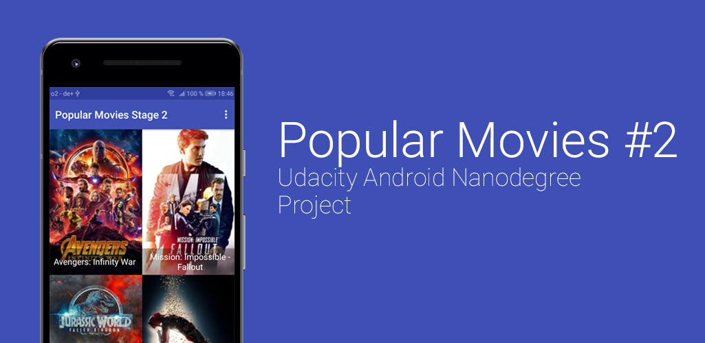

## Project Overview
The second half of the 'PopularMovies' Project.

## Get it up and running
Create a 'gradle.properties' file and insert TheMovieDBApiKey="YOUR MOVIE DB API KEY"

## What i did
- Implemented ROOM as Database
- Implemented ViewModel
- Implemented LiveData
- Parsed the Trailers & Reviews from themoviedb.org

## What i not did
- Created Fragements
- Designed a good Layout
(- realised that the white bg is #fafafa instead of #ffffff)
